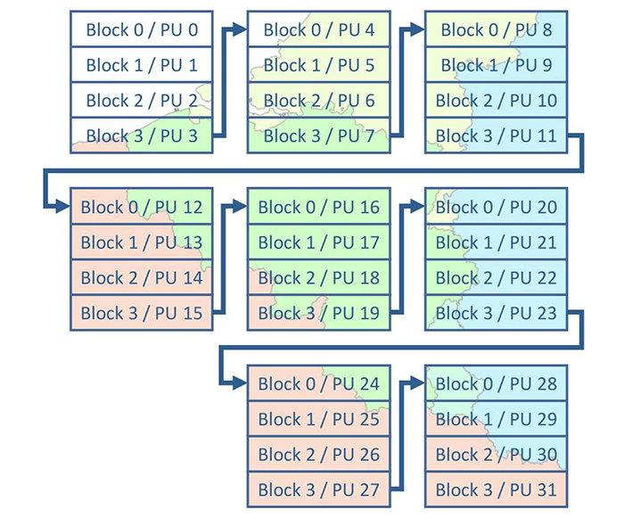

# **How to use the FORCE Data Cube Collection 1**

This tutorial describes processing abilities of [&rarr; FORCE *(Framework for Operational Radiometric Correction for Environmental monitoring)*](https://github.com/davidfrantz/force), a processing engine for medium-resolution Earth Observation image archives.

FORCE is available to CODE-DE / EOLab users and can directly be used to process Analysis Ready Data *(ARD)* provided by the FORCE Data Cube (see [&rarr; this tutorial](https://github.com/CODE-DE-EO-Lab/community_FORCE/blob/main/tutorials/datacube.md) for more details about the data cube).

In this tutorial, the principles of data processing with FORCE are introduced *(sections 2 and 3)*, followed by an overview over the FORCE higher-level component that offers numerous data processing options based on the FORCE Data Cube *(section 4-5)* - including ready-to-use examples.

## Table of Content

- [&rarr; 1. Usage policy and installation](https://github.com/CODE-DE-EO-Lab/community_FORCE/blob/main/tutorials/usage.md#1-usage-policy-and-installation)
- [&rarr; 2. FORCE processing: Overview](https://github.com/CODE-DE-EO-Lab/community_FORCE/blob/main/tutorials/usage.md#2-force-processing:-overview)
- [&rarr; 3. FORCE processing: Getting started](https://github.com/CODE-DE-EO-Lab/community_FORCE/blob/main/tutorials/usage.md#3-force-processing:-getting-started)
- [&rarr; 4. Higher-Level Processing](https://github.com/CODE-DE-EO-Lab/community_FORCE/blob/main/tutorials/usage.md#4-higher-level-processing)
    - [&rarr; 4.1. Input Data](https://github.com/CODE-DE-EO-Lab/community_FORCE/blob/main/tutorials/usage.md#41-input-data)
    - [&rarr; 4.2. Compute Model](https://github.com/CODE-DE-EO-Lab/community_FORCE/blob/main/tutorials/usage.md#42-compute-model)
    - [&rarr; 4.3. Auxiliary Data](https://github.com/CODE-DE-EO-Lab/community_FORCE/blob/main/tutorials/usage.md#43-auxiliary-data)
    - [&rarr; 4.4. Parameter file](https://github.com/CODE-DE-EO-Lab/community_FORCE/blob/main/tutorials/usage.md#44-parameter-file)
- [&rarr; 5. Higher-Level Submodules](https://github.com/CODE-DE-EO-Lab/community_FORCE/blob/main/tutorials/usage.md#5-higher-level-submodules)
    - [&rarr; 5.1. Level 3 Compositing](https://github.com/CODE-DE-EO-Lab/community_FORCE/blob/main/tutorials/usage.md#51-level-3-compositing)
    - [&rarr; 5.2. Clear Sky Observations](https://github.com/CODE-DE-EO-Lab/community_FORCE/blob/main/tutorials/usage.md#52-clear-sky-observations)
    - [&rarr; 5.3. Time Series Analysis](https://github.com/CODE-DE-EO-Lab/community_FORCE/blob/main/tutorials/usage.md#53-time-series-analysis)
    - [&rarr; 5.4. Sampling](https://github.com/CODE-DE-EO-Lab/community_FORCE/blob/main/tutorials/usage.md#54-sampling)
    - [&rarr; 5.5. Machine Learning](https://github.com/CODE-DE-EO-Lab/community_FORCE/blob/main/tutorials/usage.md#55-machine-learning)
    - [&rarr; 5.6. Texture Metrics](https://github.com/CODE-DE-EO-Lab/community_FORCE/blob/main/tutorials/usage.md#56-texture-metrics)
    - [&rarr; 5.7. Landscape Metrics](https://github.com/CODE-DE-EO-Lab/community_FORCE/blob/main/tutorials/usage.md#57-landscape-metrics)
    - [&rarr; 5.8. User Defined Functions](https://github.com/CODE-DE-EO-Lab/community_FORCE/blob/main/tutorials/usage.md#58-user-defined-functions)
- [&rarr; 6. Jupyter Notebook](https://github.com/CODE-DE-EO-Lab/community_FORCE/blob/main/tutorials/usage.md#6-jupyter-notebook)
- [&rarr; 7. Further Reading](https://github.com/CODE-DE-EO-Lab/community_FORCE/blob/main/tutorials/usage.md#7-further-reading)


# 1. Usage policy and installation

> FORCE is a completely free and open-source [*(&rarr; GPL-3.0)*](https://force-eo.readthedocs.io/en/latest/policy/license.html#gnu-general-public-license) processing framework developed by few volunteers in a scientific context. As such, it can only thrive with public endorsement and through fair usage.
Please consider recommendations for citation and acknowledgement.

The recommended way for using FORCE on CODE-DE and EOLab is through Docker
 [&rarr; walkthrough](https://github.com/CODE-DE-EO-Lab/community_FORCE/blob/main/FAQ/install.md).

For further information, please refer to the [&rarr; FORCE documentation](https://force-eo.readthedocs.io/en/latest/index.html).


# 2. FORCE processing: Overview

FORCE is an all-in-one processing engine for medium-resolution Earth Observation image archives.
It is organized in a modular way, completely covering typical Earth Observation Analysis workflows - from data download to generating ARD and high-level processing.

FORCE modules are categorized as follows:
___

#### 1) Lower-Level Components

FORCE lower-level components encompass data organization and pre-processing algorithms.
This includes, for example, data download, or data pooling as well as the generation of ARD, that includes radiometric correction, cloud and cloud shadow detection, harmonization, and data cube generation.

CODE-DE / EOLab users can skip this step, and directly access Sentinel-2 and Landsat ARD for complete Germany from 1984 to today via the FORCE Data Cube.

Please refer to [&rarr; this tutorial](https://github.com/CODE-DE-EO-Lab/community_FORCE/blob/main/tutorials/datacube.md) for further information about data pre-processing in the FORCE Data Cube, and to the FORCE [&rarr; documentation](https://force-eo.readthedocs.io/en/latest/index.html) for further information about lower-level functionality.

___

#### 2) Higher-Level Components

FORCE higher-level components provide algorithms for data processing.

Those can be fed with *ARD* or *feature* datasets in order to create *highly Analysis Ready Data (hARD)* and *highly Analysis Ready Data plus (hARD+)*, respectively ([&rarr; Frantz 2019](https://www.mdpi.com/2072-4292/11/9/1124)).
While hARD describes easy-to-use spatial or temporal data aggregations such as best available pixel composites, spectral-temporal metrics, or texture metrics based on ARD, hARD+ describes meaningful and application-ready data from, for example, trend analysis, or machine learning classification and regression methods.

FORCE higher-level components are at the core of this article.
Please refer to *section 4* for a detailed description of FORCE higher-level functionalities.

___

#### 3) Auxiliary Components

FORCE provides a range of auxiliary functions that support data handling.
That includes, for example, translating external data into a specific ARD data cube format, or mosaicking image chips mosaicking for easier visualization.


# 3. FORCE processing: Getting started

Once properly set up with [&rarr; Docker](https://github.com/CODE-DE-EO-Lab/community_FORCE/blob/main/FAQ/install.md), CODE-DE / EOLab users can make use of the full functionality of FORCE, including all submodules.

Users can execute

```
dforce
```

to obtain information about your current FORCE version as well as usage recommendations and all currently available FORCE modules.

```
$ Hello user! You are currently running FORCE v. 3.7.8
$ ... [output truncated]
```


All higher-level functionalities are subsumed under the higher-level component. Type

```
dforce force-higher-level
```

to see the requirements to execute this component.

```
$ Usage: force-higher-level [-h] [-v] [-i] parameter-file
$
$  -h  = show this help
$  -v  = show version
$  -i  = show program's purpose
$
$  Positional arguments:
$  - 'parameter-file': parameter file for any higher level submodule
```

Each FORCE component can be run with the ``-h`` parameter to show help, with the ``-v`` parameter to show the component’s version, and with the ``-i`` parameter to show the program’s purpose.

For data processing, force-higher-level requires a *parameter-file* that will determine which submodule to execute, for example time series analysis or machine learning predictions.


# 4. Higher-Level Processing

## 4.1. Input Data

FORCE higher-level processing can be run with *ARD* or *feature* datasets, depending on the submodule.

___

#### 1) ARD

ARD is used to generate hARD, i.e. spatial or temporal data aggregations, such as spectral-temporal metrics.
In this case, ARD need to follow a strict data format, including number of bands, naming convention with time stamp, and sensor information.
CODE-DE / EOLab users can directly use ARD from the FORCE Data Cube to generate hARD.

___

#### 2) features

FORCE higher-level processing can also be used with feature datasets.
Feature datasets can be previously generated hARD, or external datasets such as precipitation or digital elevation models.
Please note that FORCE higher-level components can only handle 16-bit signed input data *(i.e. -32768 to 32767)*, which might require previous rescaling of external data. 
External data must also be provided in the form of a data cube which can be generated using the auxiliary component ``force-cube``.
Feature datasets are, for example, used in machine learning processing.

## 4.2. Compute Model

The FORCE compute model is closely linked to the organization of data in the data cube (see [&rarr; this article](https://github.com/CODE-DE-EO-Lab/community_FORCE/blob/main/tutorials/datacube.md) about the FORCE Data Cube structure). FORCE uses a mixture of sequential and parallel processing logic at the same time.

___

#### 1) Sequential processing

The image chips organized in tiles have an internal block structure for partial image access.
In the example in *Figure 1*, each image chip has been divided into four blocks that represent the main processing units (*PU* - in the FORCE Data Cube, it is 10 PUs).
Block size (and consequently the number of PUs) can be overruled with the ``BLOCK_SIZE`` key in the parameter file to accommodate situations where available RAM might become an issue. 
In principle, the PUs are processed sequentially, i.e. one after another.



*Figure 1 FORCE compute model: Processing Units (PU) and sequential processing of block structure*

___

#### 2) Parallel processing

On top of that, FORCE uses a streaming strategy, where data input (i.e. reading), computing (i.e. processing), and output (i.e. writing) are done simultaneously.
For example, while PU 16 is being read from the data cube, PU 17 will already be processed, and results from PU 15 are written to disk (this is similar to the grey and red bars on YouTube).
This is complemented by a parallelization strategy, that is also able to distribute reading different images, computing different pixels, and writing different products at the same time *(nested parallelism)*.
The number of threads to be used for parallel input / computation / output can be separately chosen in the parameter file. See [&rarr; here for more details](https://force-eo.readthedocs.io/en/latest/components/higher-level/hl-compute.html).

Once running, the program will output a progress bar that allows the user to identify whether their job is input-, compute-, or output-bound, and hence can redistribute ressources accordingly.


## 4.3. Auxiliary Data

The FORCE higher-level component supports the optional use of two auxiliary datasets.

#### 1) Tile allow-list

Tile allow-lists are an optional input and can be used to limit the analysis to specific *tiles*.

They are particularly useful, as processing time can be reduced when the area of interest has a non-square extent.

Generally, the processing extent is provided by the ``X_TILE_RANGE`` and ``Y_TILE_RANGE`` keys in the parameter files. 
Minimum and maximum tile identifiers are provided based on the tiling grid (refer to [&rarr; this article](https://github.com/CODE-DE-EO-Lab/community_FORCE/blob/main/tutorials/datacube.md) for further details about the FORCE Data Cube tiling grid or just conveniently download [&rarr; this vector dataset](https://github.com/CODE-DE-EO-Lab/community_FORCE/blob/main/grid/datacube-grid_DEU.gpkg)).

Assuming the region of interest for our analysis is the Federal state of Berlin *(Figure 2)*, we require processing of all tiles marked with an ``X`` (5 tiles).
Without a tile allow-list, all tiles marked with an ``O`` (1 tile) that are part of the squared extent *(bold box)* would undergo the same processing (in other words: wasted computing time). Using a tile allow-list in our example reduces processing time by *17%*.


*Figure 2: Tiles of interest (green, X) and other tiles (red, O) part of the squared extent of the area of interest (**bold**).
Example: Berlin, Germany.*

A tile allow-list can be defined in the parameter file for higher level processing using the ``FILE_TILE`` key.

A tile allow-list is a text file that must be prepared as follows: the 1st line must give the number of tiles for which output should be created.
The corresponding tile IDs must be given in the following lines, one ID per line.
End with an empty line.

The example of Berlin looks like this:

```
5
X0069_Y0042
X0069_Y0043
X0070_Y0042
X0070_Y0043
X0070_Y0044
```

The ready-to-go tile allow-list for Berlin and all other states can be [&rarr; downloaded here](https://github.com/CODE-DE-EO-Lab/community_FORCE/tree/main/tile_files).

___

#### 2) Processing masks

Processing masks can be used to restrict processing and analysis to certain *pixels* of interest, which, again, reduces processing time (e.g. if you are only interested in the forested area).

The masks need to be in data cube format, i.e. they need to be raster images in the same grid as all the other data.

The masks should be binary images, and pixels that have a mask value of ``0`` will be skipped.
Masks can be generated from raster data or vector data using ``force-cube`` or ``force-procmask``.

For details, please refer to our [&rarr; processing masks tutorial](https://force-eo.readthedocs.io/en/latest/howto/masks.html).

## 4.4. Parameter file

FORCE’s higher-level component requires a parameter file as the sole argument.

This parameter file will determine the submodule to be executed as well as all relevant input, output, and processing parameters.
For each submodule, a skeleton file can be generated using:

```
dforce force-parameter parameter-file module
```

*parameter-file* indicates the output path of the file to be created.
*Module* is the module this parameter file should be created for.
To show available modules:

```
dforce force-parameter -m
```

```
$  available modules:
$    LEVEL2:   Level 2 Processing System
$    LEVEL3:   Level 3 Processing System
$    TSA:      Time Series Analysis
$    CSO:      Clear-Sky Observations
$    UDF:      Plug-In User Defined Functions
$    L2IMP:    Level 2 ImproPhe
$    CFIMP:    Continuous Field ImproPhe
$    SMP:      Sampling
$    TRAIN:    Train Machine Learner
$    SYNTHMIX: Synthetic Mixing
$    ML:       Machine Learning
$    TXT:      Texture
$    LSM:      Landscape Metrics
$    LIB:      Library Completeness
```


The following keys are *always* part of a higher-level parameter file. ``XXX`` is the respective submodule.


```
++PARAM_XXX_START++
 
# INPUT/OUTPUT DIRECTORIES
# -------------------------------------------------------------
DIR_LOWER = NULL
DIR_HIGHER = NULL
 
# MASKING
# -------------------------------------------------------------
DIR_MASK = NULL
BASE_MASK = NULL
 
# OUTPUT OPTIONS
# -------------------------------------------------------------
OUTPUT_FORMAT = GTiff
OUTPUT_EXPLODE = FALSE
 
# PARALLEL PROCESSING
# -------------------------------------------------------------
NTHREAD_READ = 8
NTHREAD_COMPUTE = 22
NTHREAD_WRITE = 4
 
# PROCESSING EXTENT AND RESOLUTION
# -------------------------------------------------------------
X_TILE_RANGE = 69 70
Y_TILE_RANGE = 42 44
FILE_TILE = NULL
BLOCK_SIZE = 0
RESOLUTION = 10

# more keys (module-specific)

++PARAM_XXX_END++
```

For further information about those keys, please refer to previous sections or the description provided by the parameter file itself (use ``force-parameter`` without ``-c``), or refer to the [&rarr; in-depth documentation](https://force-eo.readthedocs.io/en/latest/components/higher-level/hl-submodules.html).


# 5. Higher-Level Submodules

FORCE higher-level currently consists of ten submodules, all executable with

```
dforce force-higher-level parameter-file
```

This section includes working examples defined to work with a ``hm.2xlarge`` flavored VM.

The easiest way to reproduce the examples is to clone this community repository in the ``eouser`` home directory:

```
cd /home/eouser
git clone https://github.com/CODE-DE-EO-Lab/community_FORCE.git
cd community_FORCE/examples/parameter_files
```

___

## 5.1. Level 3 Compositing

The Level 3 Compositing submodule generates temporal aggregations of Analysis Ready Data (ARD) to provide seamless, gap free, and highly Analysis Ready Data (hARD) over very large areas.
hARD are excellent inputs for many machine learning algorithms, e.g. for land cover / change classification purposes.
The aggregation is performed using a parametric weighting scheme-based selection algorithm commonly known as best available pixel *(BAP)* compositing, using static target dates ([&rarr; Griffiths et al.
2013](https://ieeexplore.ieee.org/document/6415303)), or dynamic target dates ([&rarr; Frantz et al.
2017](https://www.sciencedirect.com/science/article/abs/pii/S0034425717300032?via%3Dihub)).

That means that this submodule generates spatially consistent large-area data with high-quality pixel values for a specified date, or a specified phenological status.

#### Input Data

This submodule requires ARD as available in the FORCE Data Cube as input for static target dates.
Computing dynamic target dates based on surface phenology additionally requires feature input from a Land Surface Phenology (LSP) dataset, which can be generated using the *Time Series Analysis* submodule.

#### Parameter file

You can create a new Level 3 Compositing parameter file with:

```
dforce force-parameter my-parameter-file.prm LEVEL3
```

or use/modify the provided example ``force-prm-LEVEL3.prm``.

As the Level 3 Compositing submodule creates temporally aggregated data, ``PROCESSING TIMEFRAME`` parameters describe the date range, i.e.
the overarching study period, and day-of-year range, i.e. possible seasonal restrictions, of all considered clear-sky observations.

Depending on whether a Best Available Pixel Composite *(BAP)* or Phenology Adaptive Compositing *(PAC)* should be performed, the respective parameters are of importance.
If you require *PAC*, set ``LSP_DO = TRUE``.
Otherwise, all *PAC*-related parameters will be ignored.
For an encompassing description of parameterization, please see the [&rarr; FORCE documentation](https://force-eo.readthedocs.io/en/latest/components/higher-level/l3).

#### Output Data

Output data are organized in the FORCE Data Cube format.

Example filename: ``20160701_LEVEL3_LNDLG_BAP.tif``

Each file name indicates the target date (here: *20160701*), the sensor ID of the selected sensor family (e.g. Landsat legacy bands: *LNDLG*), and the product type (e.g. *Best Available Pixel BAP*).

In the parameter file, the user can select four types of output data.

1) ``OUTPUT_BAP`` is the best pixel composites, i.e. a reflectance product.
The scale is *10000*, and nodata value is *-9999*.
The product contains multiple bands, which represent wavelengths.
The number of bands is dependent on the sensor used.

2) ``OUTPUT_INF`` contains information about the selected observation in the BAP product, for example *Quality Assurance Information* of the best observation, or the *acquisition dates* of the BAP composite.

3) ``OUTPUT_SCR`` contains the scores of the selected observation in the BAP product, i.e. information about the adequacy of the selected pixel for the expected target date.

4) ``OUTPUT_OVV`` is a small quicklook image of the composite without geographic reference.

#### Working Example

CODE-DE / EOLab users can use the working example of a Level 3 Compositing parameter file provided in this repository:

```
dforce force-higher-level force-prm-LEVEL3.prm
```

This generates a best-pixel composite for the target year 2020 and target day-of-year 180 from all Sentinel-2A/B clear sky observations based on data from 2019-2021 for Berlin.

#### Further Reading

Please refer to the [&rarr; FORCE Level 3 Compositing documentation](https://force-eo.readthedocs.io/en/latest/components/higher-level/l3/index.html#level3) with a processing workflow illustration for further detail.

___


## 5.2. Clear Sky Observations

The Clear Sky Observations submodule assists in data availability mining.
It assesses availability metrics of all clear-sky observations of a specified set of sensors within a specified period.
That encompasses, for example, the number of observations, or the average number of days between observations.

#### Input Data

This submodule requires ARD as available in the FORCE Data Cube as input, as it assesses data availability of ARD.

#### Parameter file

You can create a new Clear Sky Observations parameter file with:

```
dforce force-parameter my-parameter-file.prm CSO
```

or use/modify the provided example ``force-prm-CSO.prm``.


The key parameters for the Clear Sky Observation submodule are the bin width that is used to summarize CSOs (e.g. *1* for monthly, *12* for annual), as well as the metrics to be calculated on CSOs.

Multiple metrics can be computed at the same time.
For an encompassing description of parameterization, please see the [&rarr; FORCE documentation](https://force-eo.readthedocs.io/en/latest/components/higher-level/cso).

#### Output Data

Output data are organized in the FORCE Data Cube format.

Example filename: ``2000-2010_001-365-03_HL_CSO_LNDLG_NUM.tif``

The output represents the clear sky observation statistics selected by the user in the parameter file.

Each file name indicates the selected period (year and day-of-year: *2000-2010_001-365*), the selected sensor ID (e.g. Landsat legacy bands: *LNDLG*), and the respective statistics (e.g. number of observations: *NUM*).
Please see the [&rarr; FORCE documentation](https://force-eo.readthedocs.io/en/latest/components/higher-level/cso/format.html) for the complete naming convention.

#### Working Example


CODE-DE / EOLab users can use the working example of a CSO parameter file provided in this repository:

```
dforce force-higher-level force-prm-CSO.prm
```

This generates a monthly overview of all clear sky observations of all available Sentinel-2A/B images for 2020 for Berlin.

#### Further Reading

Please refer to the [&rarr; FORCE Clear Sky Observations documentation](https://force-eo.readthedocs.io/en/latest/components/higher-level/cso) with a processing workflow illustration for further detail.

___

## 5.3. Time Series Analysis

The Time Series Analysis submodule provides out-of-the-box time series preparation and analysis functionality.
The Time Series Analysis submodule provides a very large variety of different data output types, including hARD and hARD+ datasets that can be used as an input to the Machine Learning submodule or directly analysed.
The submodule can, for example, generate Land Surface Phenology metrics, time series interpolation, change and trend analyses, or spectral-temporal metrics.

#### Input Data

This submodule requires ARD as available in the FORCE Data Cube as input, as it generates time series metrics from ARD.

#### Parameter file

You can create a new Time Series Analysis parameter file with:

```
dforce force-parameter my-parameter-file.prm TSA
```

or use/modify the provided example ``force-prm-TSA.prm``.

The Time Series Analysis submodule parameter file is one of the more complex parameter files (but also one of the most powerful ones).

Here, the user can select numerous indices and metrics to be computed.
While this is very handy, please keep in mind that depending on parameterization you can potentially generate an absurd number of results and quickly fill up disc space.
Fully parameterized, this submodule can output 5508 products! 
Each of these products are multi-band images.

Some of these products, e.g. interpolated time series, can have 1000s of bands.

Try to reduce the number of metrics (e.g. in ``INDEX = ...``) or outputs (e.g. by setting ``OUTPUT_XXX = FALSE`` if not required).
While some parameters are rather self-explanatory, e.g.

```
# SPECTRAL TEMPORAL METRICS
# -------------------------------------------------------------
OUTPUT_STM = TRUE
STM = Q25 Q50 Q75 AVG STD
```

Some might require explanation.
For example, ``FOLDING PARAMETERS`` describe the temporal organization of the time series analysis.

```
FOLD_TYPE = AVG
STANDARDIZE_FOLD = NONE
OUTPUT_FBY = TRUE
OUTPUT_FBQ = FALSE
OUTPUT_FBM = TRUE
OUTPUT_FBW = FALSE
OUTPUT_FBD = FALSE
OUTPUT_TRY = TRUE
OUTPUT_TRQ = FALSE
OUTPUT_TRM = FALSE
OUTPUT_TRW = TRUE
OUTPUT_TRD = FALSE
OUTPUT_CAY = FALSE
OUTPUT_CAQ = FALSE
OUTPUT_CAM = FALSE
OUTPUT_CAW = FALSE
OUTPUT_CAD = FALSE
```

This outputs yearly and monthly time series of the average of all indices requested in ``INDEX`` as well as a trend analysis over yearly and weekly average values.
For an encompassing description of parameterization, please see the [&rarr; FORCE documentation](https://force-eo.readthedocs.io/en/latest/components/higher-level/tsa/param.html).


#### Output Data

Output data are organized in the FORCE Data Cube format.

Example filename: ``1984-2020_182-274_HL_TSA_LNDLG_TCG_STM.tif``

As the Time Series Analysis submodule provides a huge variety of possible outputs, output naming conventions are similarly complex.

In this example, Tasseled Cap Greenness (*TCG*) metrics for all clear-sky observations between *1984 and 2020*, and between day of year *182 and 274*, have been computed for Landsat Legacy Bands (*LNDLG*).

After the temporal and sensor information, the file name contains information about a possibly used *index* (or *band*), and product type (e.g. *STM* for spectral-temporal metrics.
Output file names are highly dependent on the choices the user made in the corresponding parameter file.
Please see the [&rarr; FORCE documentation](https://force-eo.readthedocs.io/en/latest/components/higher-level/tsa/format.html) for the complete naming convention.

#### Working Example

CODE-DE / EOLab users can use the working example of a Time Series Analysis parameter file provided in this repository:

```
dforce force-higher-level force-prm-TSA.prm
```

This generates the median, maximum, mean, 25th and 75th percentile of the Normalized Difference Vegetation Index (NDVI), Tasseled Cap Greenness, and reflectance, from all Sentinel-2A/B clear sky observations for 2020 for Berlin.

#### Further Reading

Please refer to the [&rarr; FORCE Time Series Analysis documentation](https://force-eo.readthedocs.io/en/latest/components/higher-level/tsa) with a processing workflow illustration.

___

## 5.4. Sampling

The Sampling submodule provides a point-based extraction routine of features for training and validation purposes.

#### Input Data

The Sampling submodule requires a point-based dataset as well as cubed feature datasets where samples should be extracted.
The point-based dataset is provided by a list of point coordinates and class labels (with one line per point).

#### Parameter file

You can create a new Sampling parameter file with:

```
dforce force-parameter my-parameter-file.prm SMP
```

or use/modify the provided example ``force-prm-SMP.prm``.

The Sampling parameter file uses ``INPUT_FEATURE`` to point at the specific features from which samples should be extracted at given locations.
These locations are provided by a list of point coordinates and categorical or numerical labels (``FILE_POINTS``).

``FILE_SAMPLE``, ``FILE_RESPONSE`` and ``FILE_COORDINATES`` are the paths where the samples, the response (i.e. categorical or numerical labels), and the respective coordinates are stored.

#### Output Data

The output of the Sampling submodule are three comma-separated text files:

- Samples, 
- Response, and 
- Coordinates

#### Working Example

CODE-DE / EOLab users can use the working example of a Sampling parameter file provided in this repository:

```
dforce force-higher-level force-prm-SMP.prm
```
This generates samples of reflectance and Tasseled Cap Greenness metrics (25th, 50th, 75th percentile and average/maximum) of all clear sky observations of Sentinel-2A/B imagery as generated by the parameter file presented in the [&rarr; Time Series Analysis section](https://github.com/CODE-DE-EO-Lab/community_FORCE/blob/main/tutorials/usage.md#53-time-series-analysis).
Samples are linked to a land cover class label.

#### Further Reading

Please refer to the [&rarr; FORCE Sampling documentation](https://force-eo.readthedocs.io/en/latest/components/higher-level/smp) for further detail.

___


## 5.5. Machine Learning

The Machine Learning submodule generates maps from machine learning predictions.
This submodule can generate quantitative or qualitative predictions, i.e.
through regression or classification.
The resulting maps can be directly used to fuel research questions without any further processing.

#### Input Data

Typically, this submodule is fed with hARD products (features), i.e. seamless and gap free aggregate products.
hARD products can e.g. be generated by the Time Series Analysis, Level 3 Compositing, Texture Metrics, and Landscape Metrics submodules - or external hARD or other raster layers can be ingested using ``force-cube``.
Machine learning models are trained using ``force-train``.

#### Parameter file

You can create a new Machine Learning parameter file with:

```
dforce force-parameter my-parameter-file.prm ML
```

or use/modify the provided example ``force-prm-ML.prm``.

Afterwards, the features need to be defined
For example, ``INPUT_FEATURE = 2018-2018_001-365_LEVEL4_TSA_SEN2L_NDV_STM.tif 1 2 3 4 5 6``, indicates the use of the first six bands of a time series analysis file that computed temporal statistics for the year 2018 on NDVI values.

While ``DIR_MODEL`` indicates the directory where the models to be used are stored, ``FILE_MODEL = biomass-1.xml biomass-2.xml biomass-3.xml``
specifies the model set(s) used for prediction.

The basename of the machine learning model(s) (.xml) must be given.
These are generated through ``force-train``, and one or multiple models can be given. 
The predictions of the models are aggregated into the final prediction.
The aggregation function is the average for regression problems, and the mode for classification problems.
This parameter can be given multiple times, in which case multiple regressions/classifications can be computed.

Output files will have as many bands as modelsets are given.

> **Important:** The models must have been trained with the exact same number of features as given in ``INPUT_FEATURE``.

``ML_METHOD`` is the Machine learning method.
``ML_CONVERGENCE`` applies if multiple models are given for a modelset, and machine learning method is of regression flavor, in which case the models are blended into the final prediction.
Processing time scales linearly with the number of models.
However, the blended prediction will likely converge with increasing numbers of models, thus it may not be necessary to compute all models.
This parameter sets the convergence threshold.
If the predictions differ less than this value (when adding another model), no more model will be added, which speeds up processing.

For an encompassing description of parameterization, please see the [&rarr; FORCE documentation](https://force-eo.readthedocs.io/en/latest/components/higher-level/ml).

#### Output Data

Output data are organized in the FORCE Data Cube format.

Example filename: ``XXX_HL_ML_MLP.tif``

The output of the Machine Learning submodule is highly individual, depending on what response variable was chosen by the user.
This is why users can also choose a naming base (here represented by ``XXX``), followed by an indicator for higher level products (HL), the machine learning submodule tag (ML), and a specific output type (here: MLP).

In the parameter file, the user can select which data products to generate.
*MLP* is the machine learning prediction.

*MLI* describes the number of models used when ``ML_CONVERGENCE`` is used.
*MLU* describes the standard deviation of all predictions that are blended into the final prediction.
This only makes sense when multiple models are given in a model set.

When Random Forest Classification is used (i.e. ``ML_METHOD = RFC``), *RFP* describes the pixel-wise class probabilities, and *RFM* describes the Random Forest margin.

#### Working Example


CODE-DE / EOLab users can use the samples created in the Sampling section of this article along with the parameter files provided in this repository:

In a first step, a random forest classifier is trained:

```
dforce force-train force-prm-TRAIN.prm
```

In a next step, the output model is used in a Machine Learning  parameter file to predict land cover classes across the state of Berlin.

```
dforce force-higher-level force-prm-ML.prm
```

This file supposes that the CODE-DE user has performed the Time Series Analysis example parameter file to create spectra-temporal metrics of the study area.
Then, a sampling as described in the Sampling section is required.
Final maps predict land cover (built-up surfaces, vegetation, soil, water) in the Berlin area (*Figure 3*).


*Figure 3: Land cover as predicted using the above sampling → training → machine learning prediction workflow with a Random Forest Classifier.
Red: Built-Up Surfaces, Green: Vegetation, Yellow: Soil, Blue.
Water.*

#### Further Reading

Please refer to the [&rarr; FORCE Machine Learning documentation](https://force-eo.readthedocs.io/en/latest/components/higher-level/ml) with a processing workflow illustration for further detail.

___

## 5.6. Texture Metrics

The Texture Metrics submodule generates spatially aggregated data (hARD) using morphological image analysis.
Texture metrics are computed considering not only a single pixel value, but also values of all surrounding pixels within a specified radius, using a variety of morphological operators.
This way, spatially contextual information can be made use of, for example three-dimensional shadow information for [&rarr; building height prediction](https://doi.org/10.1016/j.rse.2020.112128).

#### Input Data

This submodule typically uses hARD products, i.e. seamless and gap free aggregate products.
However, texture metrics can similarly be computed on ARD as available in the FORCE Data Cube, if single scenes are of interest.
Texture metrics can, of course, also be calculated on external (cubed) datasets if the user’s workflow requires this (&rarr; ``force-cube``).

#### Parameter file

You can create a new Texture Metrics parameter file with:

```
dforce force-parameter my-parameter-file.prm TXT
```

or use/modify the provided example ``force-prm-TXT.prm``.

The Texture Metrics parameter file uses an ``INPUT_FEATURE`` parameter that points at all features that Texture Metrics should be computed for (file name followed by an enumeration of bands).

```
TXT_RADIUS = 50
TXT_ITERATION = 1
TXT = DIL ERO BHT
```

describe the radius to be applied for texture computation (meters for FORCE Data Cube), the number of iterations (i.e. *3* means the texture is iteratively calculated three times, which increases texture effect), and the kind of texture.
Currently available metrics are *dilation, erosion, opening, closing, gradient, blackhat and tophat*.
For an encompassing description of parameterization, please see the [&rarr; FORCE documentation](https://force-eo.readthedocs.io/en/latest/components/higher-level/txt).

#### Output Data

Output data are organized in the FORCE Data Cube format.

Example filename: ``TEXTURE_HL_TXT_CLS.tif``

The output of the Texture Metrics submodule is rather standardized, as the user can only choose between different morphological metrics to be applied.
*TEXTURE* is the name base that can be adapted by the user in the parameter file.
Here, *CLS* is the closing operator tag.
The data is represented in the same type as the input data, e.g. reflectance with a scale of *10000* if ARD from the FORCE Data Cube is used.

#### Working Example

CODE-DE / EOLab users can use the working example of a Texture Metrics parameter file provided in this repository:

```
dforce force-higher-level force-prm-TXT.prm
```

This generates dilation and erosion metrics from the 25th, 50th and 75th percentile of reflectance of all clear sky observations of Sentinel-2A/B imagery as generated by the parameter file presented in the Time Series Analysis section.

#### Further Reading

Please refer to the [&rarr; FORCE Texture Metrics documentation](https://force-eo.readthedocs.io/en/latest/components/higher-level/txt) with a processing workflow illustration for further detail.

___

## 5.7. Landscape Metrics

The Landscape Metrics submodule quantifies spatial patterns of a given feature.
This submodule uses a continuous moving window approach and computes a set of landscape metrics for each pixel and its surrounding area within a specified radius, for example edge density, the number of patches, or mean patch area.
It also computes arithmetic and geometric mean, standard deviation and maximum of all pixel values within this radius.

#### Input Data

This submodule typically uses hARD+ products, i.e.
datasets immediately ready to analyze, such as land cover maps, because that is often where spatial patterns are of interest.
The submodule accepts cubed raster data with a discrete or continuous data structure, including external hARD+ ingested by using ``force-cube``.

#### Parameter file

You can create a new Landscape Metrics parameter file with:

```
dforce force-parameter my-parameter-file.prm LSM
```

or use/modify the provided example ``force-prm-LSM.prm``.

The Landscape Metrics parameter file uses an ``INPUT_FEATURE`` parameter that points at all features that Landscape Metrics should be computed for (file name followed by an enumeration of bands).

``LSM_RADIUS`` describe the radius to be applied for landscape metrics computation in data cube projection units (meters for FORCE Data Cube).
``LSM_KERNEL_SHAPE`` indicates whether a circular or squared kernel should be used as a moving window.
``LSM_MIN_PATCHSIZE`` describes the minimum number of pixels of a patch in order to be considered a patch (i.e. *1* means no minimum).
``LSM_THRESHOLD_TYPE`` defines the type of the threshold that is used to define the foreground class (greater then, greater than or equal to, less than, less than or equal to, equal to) for each given feature.
The list needs to be as long as there are features.
``LSM_THRESHOLD`` defines the threshold.
All pixels that are greater than, lower than or equal to this threshold are defined as foreground class.
Landscape metrics are computed for pixels covererd by the foreground class.
No metrics are computed for the pixels covered by the background class.
The list needs to be as long as there are features (including bands).
For statistical metrics (e.g. *geometric mean*), these thresholds are used as a mask.
``LSM_ALL_PIXELS`` determines if the landscape metrics are also calculated for pixels covered by the background class.
For an encompassing description of parameterization, please see the [&rarr; FORCE documentation](https://force-eo.readthedocs.io/en/latest/components/higher-level/lsm).

#### Output Data

Output data are organized in the FORCE Data Cube format.

Example filename: ``LSMBASE_HL_LSM_MPA.tif``

The output of the Landscape Metrics submodule is rather standardized, as the user can only choose between different metrics to be applied.
*LSM* is the name base that can be adapted by the user in the parameter file.
Here, *MPA* is the mean patch area tag.
The output data format is depending on the selected landscape metrics to be computed.
For arithmetic and geometric mean, standard deviation and maximum, the output format corresponds to the input feature format.
Unique patch ID is nominal, number of patches is ordinal, weighted mean patch area is in projection units.
Please refer to a landscape metrics documentation such as the [&rarr; FRAGSTATS documentation](https://www.umass.edu/landeco/research/fragstats/documents/Metrics/Metrics%20TOC.htm) for further information about landscape metrics.

#### Working Example


CODE-DE / EOLab users can use the working example of a Landscape Metrics parameter file provided in this repository:

```
dforce force-higher-level force-prm-LSM.prm
```

This generates the Mean Patch Area of all vegetation patches, defined by pixels with an NDVI above 0.5, based on the 25th, 50th and 75th percentile of the NDVI of all clear sky observations of Sentinel-2A/B imagery as generated by the parameter file presented in the Time Series Analysis section.

#### Further Reading

Please refer to the [&rarr; FORCE Landscape Metrics documentation](https://force-eo.readthedocs.io/en/latest/components/higher-level/lsm) for further detail.

## 5.8. User Defined Functions

The User Defined Functions *(UDF)* submodule provides an interface that allows FORCE users to both benefit from FORCE processing capabilities and Data Cube structures and the flexibility of user-written *Python* functions.
These UDFs only contain the algorithm itself, while data handling is completely organized by FORCE.
Users can plug in simple scripts, complicated algorithms, or existing Python implementations of commonly used packages, such as BFAST, or LandTrendr.

#### Input Data

This submodule requires an existing Python file (``.py``) as well as any kind of (cubed) ARD, hARD, or hARD+ datasets, depending on the specific functionality of the user-defined function.

#### Parameter file

You can create a new UDF parameter file with:

```
dforce force-parameter my-parameter-file.prm UDF
```

or use/modify the provided example ``force-prm-UDF.prm``.

``PYTHON UDF PARAMETERS`` is the essential component of the UDF parameter file.
Here, the path to the python file is given (``FILE_PYTHON``), and the type of the function.
``PIXEL`` expects a pixel-function that receives the time series of a single pixel as *4D-nd array [nDates, nBands, nrows, ncols]*.
``BLOCK`` expects a pixel-function that receives the time series of a complete  processing unit as *4D-nd.array [nDates, nBands, nrows, ncols]*.

#### Output Data

Output data types are largely defined by the user’s requirements.

#### Working Example

CODE-DE / EOLab users can use the working example of a LUDF parameter file provided in this repository:

```
dforce force-higher-level force-prm-UDF.prm
```

This generates data containing Landsat reflectance values extracted from those observations where the Normalized Difference Vegetation Index (NDVI) was highest during the year 2020, i.e. a Maximum NDVI composite.
The corresponding python script is part of this repository.

#### Further Reading

Please refer to this [&rarr; FORCE User Defined Functions tutorial](https://force-eo.readthedocs.io/en/latest/howto/udf.html) for further detail.

#### Contribute your UDF!

We encourage all users to share their UDFs, such that the community as a whole benefits and has access to a broad variety of workflows.
Please refer to the [&rarr; FORCE UDF repository](https://github.com/davidfrantz/force-udf) for details. 

 
# 6. Jupyter Notebook

FORCE can be used on CODE-DE using a Jupyter Notebook that is run from your VM.
A Jupyter Notebook is a web interface that allows to combine executable code with explanatory text and other elements, which is particularly suitable for, for example, tutorials.

Please find a Jupyter notebook using FORCE on CODE-DE in this repository.
This requires the bash kernel.

In general, though, we recommend to use FORCE directly on the VM's commandline, or through srcipts.


# 7. Further Reading

- [&rarr; FORCE Code and entry point](https://github.com/davidfrantz/force)
- [&rarr; FORCE Main reference](http://doi.org/10.3390/rs11091124)
- [&rarr; FORCE Documentation](https://force-eo.readthedocs.io/en/latest/index.html)
- [&rarr; FORCE Tutorials](https://force-eo.readthedocs.io/en/latest/howto/index.html)
- [&rarr; FORCE Publications](https://force-eo.readthedocs.io/en/latest/refs.html#refs)
- [&rarr; FORCE on ResearchGate](https://www.researchgate.net/project/FORCE-Framework-for-Operational-Radiometric-Correction-for-Environmental-monitoring)
- [&rarr; FORCE on Twitter](https://twitter.com/search?q=%23FORCE_EO&src=recent_search_click)

